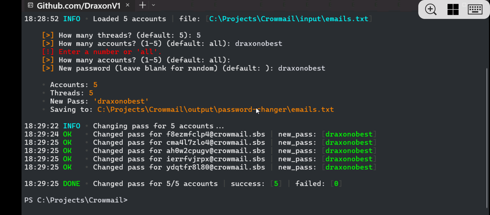
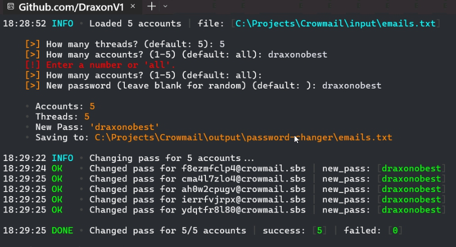

# Crowmail Suite

<p align="center">
  <b>Fast, multi-threaded Crowmail automation toolkit & Python SDK</b><br>
  <sub>Made by <a href="https://github.com/DraxonV1">@DraxonV1</a></sub>
</p>

<p align="center">
  
  
  
</p>

---

## ⚡ Overview

**Crowmail Suite** is an all-in-one automation toolkit and Python SDK for **[Crowmail](https://crowmail.sbs)**. Built with high performance, clean terminal gradients, and interactive keyboard navigation.

- **Interactive CLI Launcher**: Select tools using `↑`/`↓` arrow keys or numeric shortcuts `1-3` with graceful `CTRL+C` handling.
- **Bulk Inbox Generator**: Fast multi-threaded temporary account creator.
- **Bulk Password Changer**: High-speed password rotator with custom or random password modes.
- **Full Python SDK**: Clean, reusable `crowmail` package supporting accounts, authentication, password rotation, domains, and inbox message retrieval.
- **Dynamic Terminal Status**: Real-time console title updates displaying successes, failures, total count, and elapsed time.

---

## 📸 Screenshots

### 1. Inbox Generator


### 2. Bulk Password Changer


---

## 🚀 Quick Start

### 1. Installation

Clone repository and install dependencies:

```bash
git clone https://github.com/DraxonV1/Crowmail.git
cd Crowmail
pip install -r requirements.txt
```

### 2. Run Interactive Launcher

Launch all tools from the central menu:

```bash
python main.py
```

* Navigate options with `↑`/`↓` arrow keys and press `ENTER`.
* Or quickly press `1`, `2`, or `3`.
* Press `CTRL+C` or `ESC` anytime for clean exit.

---

## 🛠 Tools Breakdown

### 1. Bulk Inbox Generator (`gen/main.py`)
Generates disposable email inboxes concurrently and stores them in `output/generator/emails.txt`.

```bash
python gen/main.py
```

**Prompts:**
- **Inboxes**: Number of inboxes to create (default: `10`)
- **Threads**: Worker concurrency level (default: `5`)
- **Domain**: Target domain (default: `crowmail.sbs`, automatically fetched)
- **Password**: Custom password or leave blank for secure random generation (12 chars)

**Output format:**
```text
email:password
```

---

### 2. Bulk Password Changer (`password/changer.py`)
Rotates passwords for accounts in `input/emails.txt` and saves updated credentials to `output/password-changer/emails.txt`.

```bash
python password/changer.py
```

**Input format (`input/emails.txt`):**
```text
user1@crowmail.sbs:oldpass1
user2@crowmail.sbs:oldpass2
```

**Prompts:**
- **Threads**: Number of concurrent workers (default: `5`)
- **Amount**: How many accounts from input file to process (default: `all`)
- **New Password**: Custom password or leave blank for unique random passwords

**Output format (`output/password-changer/emails.txt`):**
```text
email:newpassword
```

---

## 📦 Python SDK Usage

Import and use `CrowmailClient` directly in your Python applications:

```python
from crowmail import CrowmailClient, AuthenticationError, RateLimitError

# Initialize client
with CrowmailClient() as client:
    # 1. Fetch available domains
    domains = client.get_domains()
    print("Domains:", [d["domain"] for d in domains.get("hydra:member", [])])

    # 2. Generate random credentials
    username = "testuser"
    domain = "crowmail.sbs"
    email = f"{username}@{domain}"
    password = CrowmailClient.generate_password(12)

    # 3. Create account
    account = client.create_account(email, password)
    print("Created account ID:", account.get("id"))

    # 4. Login and retrieve JWT token
    token = client.login(email, password)
    print("JWT Token:", token[:20] + "...")

    # 5. Fetch profile info
    me = client.get_me()
    print("Logged in as:", me.get("address"))

    # 6. Change account password
    new_password = CrowmailClient.generate_password(14)
    client.change_password(old_password=password, new_password=new_password)
    print("Password changed successfully!")

    # 7. Check inbox messages
    messages = client.get_messages(page=1)
    print("Total messages:", messages.get("hydra:totalItems", 0))
```

### SDK Methods

| Method | HTTP Endpoint | Description |
|---|---|---|
| `create_account(address, password)` | `POST /accounts` | Create new email account |
| `login(address, password)` | `POST /token` | Authenticate and obtain JWT token |
| `get_me()` | `GET /me` | Fetch authenticated account details |
| `change_password(old, new)` | `PATCH /accounts/me/password` | Change account password |
| `get_domains(page=1)` | `GET /domains` | List available domains |
| `get_messages(page=1)` | `GET /messages` | List inbox messages |
| `get_message(id)` | `GET /messages/{id}` | Read message contents and attachments |
| `delete_message(id)` | `DELETE /messages/{id}` | Delete message |
| `delete_account()` | `DELETE /accounts/me` | Delete current account |
| `generate_password(length=12)` | *Utility* | Generate secure alphanumeric password |

---

## 📁 Repository Structure

```text
Crowmail/
├── assets/
│   ├── gen.png                     # Screenshot: Inbox Generator
│   └── passchanger.png             # Screenshot: Password Changer
├── crowmail/                       # Crowmail Python SDK package
│   ├── __init__.py                 # Package exports
│   ├── client.py                   # CrowmailClient implementation
│   └── errors.py                   # Custom SDK exceptions
├── gen/
│   └── main.py                     # Multi-threaded inbox generator CLI
├── input/
│   └── emails.txt                  # Input file for password changer (email:pass)
├── output/
│   ├── generator/
│   │   └── emails.txt              # Generated accounts (email:pass)
│   └── password-changer/
│       └── emails.txt              # Updated accounts (email:newpass)
├── password/
│   └── changer.py                  # Multi-threaded password changer CLI
├── main.py                         # Interactive arrow-navigated CLI menu
├── requirements.txt                # Python dependencies
└── README.md                       # Documentation
```

---

## 👤 Author

- **Draxon** — [@DraxonV1](https://github.com/DraxonV1)
